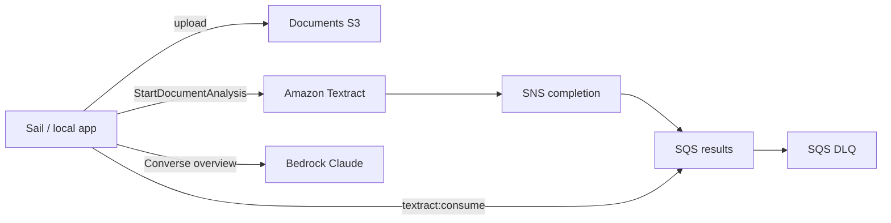

# Qompose OCR infrastructure (production only)

This Pulumi project provisions **only** the AWS pieces needed for local/Sail OCR:

- Private S3 documents bucket (KMS encrypted, versioned)
- Textract completion SNS topic → SQS results queue (+ DLQ)
- IAM role Textract assumes to publish SNS
- IAM user + access key for local Textract + Bedrock + S3/SQS (synced into `.env`)
- Optional DLQ email alarm

No VPC, ECS, ALB, RDS, Redis, or ECR.



## Deploy

```bash
cd apps/platform/infra
npm ci
pulumi login
pulumi stack select production   # or: pulumi stack init production
npm run preview
npm run up
pulumi stack output
```

`npm run preview` / `npm run up` compile TypeScript to `bin/` first. Pulumi runs the compiled JS (avoids ts-node `.js` import issues).
Optional alarm email:

```bash
pulumi config set alarmEmailAddress you@example.com
```

Confirm the SNS email subscription after the first deploy if you set that.

## Wire Sail / `.env`

After `pulumi up`, copy stack outputs into `apps/platform/.env`:

```bash
OCR_DRIVER=textract
FILESYSTEM_DISK=s3
AWS_DEFAULT_REGION=eu-west-1
AWS_BUCKET=<documentsBucketName>
TEXTRACT_SNS_TOPIC_ARN=<textractSnsTopicArn>
TEXTRACT_SNS_ROLE_ARN=<textractPublishRoleArn>
TEXTRACT_RESULTS_QUEUE_URL=<textractResultsQueueUrl>
OCR_BEDROCK_MODEL_ID=eu.anthropic.claude-sonnet-4-20250514-v1:0
```

### Sync OCR IAM credentials

AWS **root cannot assume IAM roles**. This stack creates an IAM user + access key instead.
Sync them into `.env` (requires a working root/admin CLI for `pulumi stack output`):

```bash
cd apps/platform/infra
chmod +x scripts/sync-ocr-credentials.sh
./scripts/sync-ocr-credentials.sh
```

That sets `AWS_ACCESS_KEY_ID` / `AWS_SECRET_ACCESS_KEY`, clears `AWS_SESSION_TOKEN`, and clears MinIO endpoints.

```bash
vendor/bin/sail artisan config:clear
vendor/bin/sail artisan textract:consume
```

## Outputs

| Output | Purpose |
|--------|---------|
| `documentsBucketName` | S3 bucket for uploads |
| `textractSnsTopicArn` | Textract notification topic |
| `textractPublishRoleArn` | Role Textract assumes for SNS |
| `textractResultsQueueUrl` | Consumer queue URL |
| `textractResultsDeadLetterQueueUrl` | Failed messages |
| `ocrLocalUserName` | IAM user for local OCR |
| `ocrAccessKeyId` | Access key id (also via sync script) |
| `ocrSecretAccessKey` | Secret key (Pulumi secret; use sync script) |
| `ocrEncryptionKeyArn` | KMS key for bucket/queues |

## Important

Running `pulumi up` against an existing full-platform production stack will **destroy** ECS, RDS, ALB, VPC, etc. that are no longer in this program. Preview carefully before applying.
