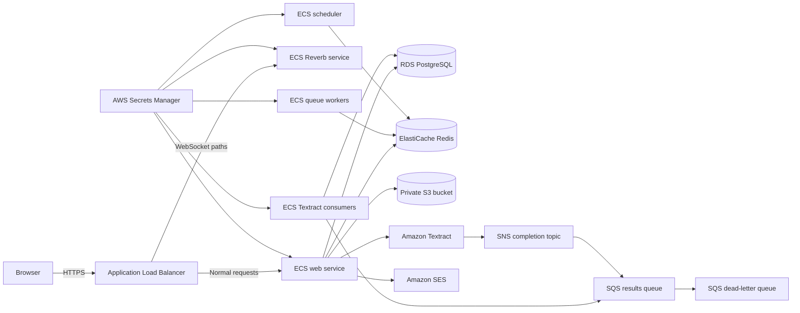

# Deploy the Qompose platform to AWS

This guide explains how to configure, deploy, operate, and recover the Qompose staging and production environments. Use the GitHub Actions deployment workflow for routine deployments. Use Pulumi locally for previews and investigation.

## What the stack includes

The Pulumi project creates a complete application environment in one AWS Region:

- A dedicated Virtual Private Cloud (VPC) across two Availability Zones
- Public subnets for the Application Load Balancer (ALB) and NAT gateways
- Private subnets for application tasks, PostgreSQL, and Redis
- An Amazon Elastic Container Registry (ECR) repository with immutable tags
- Amazon Elastic Container Service (ECS) services on AWS Fargate
- An Amazon Relational Database Service (RDS) PostgreSQL database
- An Amazon ElastiCache Redis replication group
- A private, versioned Amazon Simple Storage Service (S3) documents bucket
- Amazon Textract completion notifications through Amazon Simple Notification Service (SNS) and Amazon Simple Queue Service (SQS)
- AWS Key Management Service (KMS) encryption for application data
- AWS Secrets Manager secrets for Laravel, Redis, Reverb, and PostgreSQL
- CloudWatch logs, alarms, Container Insights, and ECS autoscaling
- An optional Route 53 alias record and optional email alarms

The stack does not create long-lived AWS access keys. ECS tasks receive short-lived credentials through an IAM workload role.

## How requests and background work flow




The load balancer terminates Transport Layer Security (TLS). It forwards normal requests to the web service and `/app/*` or `/apps/*` requests to Reverb. All ECS tasks run in private subnets without public IP addresses.

The web service starts asynchronous Textract jobs for documents in S3. Textract publishes completion events to SNS. SNS sends each event to SQS, and the Textract consumer processes the result. SQS moves a message to the dead-letter queue after five failed deliveries.

## Compare staging and production

Both stacks run Laravel with `APP_ENV=production`. This enables the same configuration validation in staging and production.


| Setting                         | Staging                     | Production                                 |
| ------------------------------- | --------------------------- | ------------------------------------------ |
| VPC range                       | `10.10.0.0/16`              | `10.20.0.0/16`                             |
| NAT gateways                    | 1                           | 2, one per Availability Zone               |
| Web tasks                       | 1                           | 2                                          |
| Queue workers                   | 1                           | 2                                          |
| Reverb tasks                    | 1                           | 2                                          |
| Textract consumers              | 1                           | 2                                          |
| Scheduler tasks                 | 1                           | 1                                          |
| Autoscaling range               | 1 to 2                      | 2 to 8                                     |
| PostgreSQL engine               | 17                          | 17                                         |
| PostgreSQL                      | `db.t4g.micro`, single-AZ   | `db.t4g.small`, Multi-AZ                   |
| PostgreSQL backups              | 7 days                      | 35 days                                    |
| Redis                           | `cache.t4g.micro`, one node | `cache.t4g.small`, two nodes with failover |
| CloudWatch log retention        | 30 days                     | 90 days                                    |
| S3 noncurrent version retention | 14 days                     | 90 days                                    |
| Deletion protection             | Disabled                    | Enabled for RDS and ALB                    |
| KMS and secret recovery window  | 7 days                      | 30 days                                    |


Staging allows Pulumi to empty its S3 bucket and ECR repository during deletion. Production retains those safeguards and creates a final RDS snapshot.

## Understand ongoing AWS costs

The stack creates billable resources even when the application is idle. NAT gateways, the ALB, RDS, ElastiCache, and Fargate tasks form the baseline cost.

Production costs more because it runs two NAT gateways, Multi-AZ PostgreSQL, two Redis nodes, and at least two tasks for four ECS services. Review the [AWS Pricing Calculator](https://calculator.aws/) before deployment.

## Complete the prerequisites

Prepare these resources before the first deployment:

1. Choose an AWS account and Region with at least two Availability Zones. The default Region is `eu-west-1`.
2. Create or import an AWS Certificate Manager (ACM) certificate for the application domain. Create it in the same Region as the ALB.
3. Verify the sending domain or address in Amazon Simple Email Service (SES). Request SES production access in every deployment account and Region.
4. Create a Pulumi Cloud account and an access token, or configure a compatible Pulumi backend.
5. Add GitHub as an OpenID Connect (OIDC) provider in AWS Identity and Access Management (IAM).
6. Create dedicated GitHub deployment roles for staging and production.
7. Decide whether Pulumi should manage the application DNS record in an existing Route 53 public hosted zone.

Use separate AWS accounts for staging and production when possible. The GitHub environments can reference different role ARNs, Regions, certificates, domains, and hosted zones.

### Configure the ACM certificate

Request a public ACM certificate for each application hostname, such as `staging.qompose.com` and `app.qompose.com`. Validate each certificate before deployment.

ACM certificates are regional resources. The certificate ARN configured for an environment must belong to the same Region as its ALB. See the [AWS Certificate Manager overview](https://docs.aws.amazon.com/acm/latest/userguide/acm-overview.html).

### Configure Amazon SES

The application sends email through the SES API. The stack grants the ECS task role permission to call `ses:SendEmail` and `ses:SendRawEmail`, but it does not create an SES identity.

For each AWS account and Region:

1. Verify the domain used by `MAIL_FROM_ADDRESS` in SES.
2. Publish the SES verification and DomainKeys Identified Mail (DKIM) DNS records.
3. Request production access to leave the SES sandbox.
4. Send a test message before the production launch.

SES requires a verified sender identity. Sandbox accounts can send only to verified recipients. See [Verified identities in Amazon SES](https://docs.aws.amazon.com/ses/latest/dg/verify-addresses-and-domains.html) and [Request production access](https://docs.aws.amazon.com/ses/latest/dg/request-production-access.html).

## Configure GitHub access to AWS

The deployment workflow requests short-lived AWS credentials through GitHub OIDC. Do not add AWS access keys to GitHub secrets.

### Add the GitHub OIDC provider

In the AWS IAM console, add an OIDC identity provider with these values:

- **Provider URL**: `https://token.actions.githubusercontent.com`
- **Audience**: `sts.amazonaws.com`

Skip this step if the AWS account already has the provider. Follow GitHub's [AWS OIDC configuration guide](https://docs.github.com/en/actions/how-tos/secure-your-work/security-harden-deployments/oidc-in-aws).

### Create one deployment role per environment

Create a staging role whose trust policy accepts only the `staging` GitHub environment. The following policy assumes the AWS account number `123456789012`:

```json
{
    "Version": "2012-10-17",
    "Statement": [
        {
            "Effect": "Allow",
            "Principal": {
                "Federated": "arn:aws:iam::123456789012:oidc-provider/token.actions.githubusercontent.com"
            },
            "Action": "sts:AssumeRoleWithWebIdentity",
            "Condition": {
                "StringEquals": {
                    "token.actions.githubusercontent.com:aud": "sts.amazonaws.com",
                    "token.actions.githubusercontent.com:sub": "repo:NielsvanHoof/qompose:environment:staging"
                }
            }
        }
    ]
}
```

Create a second role for production. Replace `staging` with `production` in the `sub` condition. If the repository uses GitHub's immutable OIDC subject format, use the owner and repository IDs shown in its OIDC claim.

Restrict both roles to the `NielsvanHoof/qompose` repository and their matching GitHub environments. Add required reviewers and branch restrictions to the production GitHub environment.

### Grant deployment permissions

The deployment role must manage the AWS resources declared in this Pulumi project. Grant create, read, update, tag, and delete access for these services:

- VPC and EC2 networking
- Elastic Load Balancing
- ECS, ECR, and Application Auto Scaling
- RDS and ElastiCache
- KMS and Secrets Manager
- S3, SNS, SQS, and Textract-related IAM roles
- CloudWatch metrics, alarms, and log groups
- Route 53 when `ROUTE53_HOSTED_ZONE_ID` is configured
- IAM roles, inline policies, managed policy attachments, and `iam:PassRole`
- `iam:CreateServiceLinkedRole` when the AWS account lacks a required service-linked role
- Security Token Service (STS) identity lookup

The workflow also needs permission to push ECR images, start ECS migration tasks, and create production RDS snapshots. Scope resource permissions to names prefixed with `qompose-staging-` or `qompose-production-` where the AWS API supports resource-level permissions.

Use an account-specific infrastructure policy and a permissions boundary. Validate the final policy with IAM Access Analyzer before deploying production.

## Configure the GitHub environments

Open **Repository settings**, select **Environments**, and create `staging` and `production`. Add the following values to both environments.

### Required environment variables


| Variable              | Example                                                                               | Purpose                                                     |
| --------------------- | ------------------------------------------------------------------------------------- | ----------------------------------------------------------- |
| `AWS_DEPLOY_ROLE_ARN` | `arn:aws:iam::123456789012:role/qompose-staging-deployer`                             | OIDC role assumed by the workflow                           |
| `AWS_REGION`          | `eu-west-1`                                                                           | Region for all resources in this stack                      |
| `APP_DOMAIN`          | `staging.qompose.com`                                                                 | Application hostname without `https://` or a trailing slash |
| `ACM_CERTIFICATE_ARN` | `arn:aws:acm:eu-west-1:123456789012:certificate/12345678-1234-1234-1234-123456789012` | Issued ACM certificate covering `APP_DOMAIN`                |
| `MAIL_FROM_ADDRESS`   | `support@qompose.com`                                                                 | Verified SES sender address                                 |


`AWS_REGION` defaults to `eu-west-1` when omitted. Set it explicitly so the selected certificate, SES identity, and AWS resources stay aligned.

### Optional environment variables


| Variable                 | Purpose                                                                                                                           |
| ------------------------ | --------------------------------------------------------------------------------------------------------------------------------- |
| `ROUTE53_HOSTED_ZONE_ID` | Creates an alias record for `APP_DOMAIN` in an existing public hosted zone                                                        |
| `ALARM_EMAIL_ADDRESS`    | Creates an SNS email subscription for CloudWatch and Laravel health alerts                                                        |
| `PULUMI_BACKEND_URL`     | Overrides the default `https://api.pulumi.com` backend when the workflow already supports its authentication and secrets provider |


When you configure `ALARM_EMAIL_ADDRESS`, AWS sends a subscription confirmation message after the first deployment. Confirm it before testing alarms.

If you omit `ROUTE53_HOSTED_ZONE_ID`, create DNS yourself after deployment. Point the application hostname at the `loadBalancerDnsName` Pulumi output. Use an alias record at an apex domain.

### Required environment secrets


| Secret                | Purpose                                                           |
| --------------------- | ----------------------------------------------------------------- |
| `PULUMI_ACCESS_TOKEN` | Authenticates the workflow to Pulumi Cloud                        |
| `APP_KEY`             | Laravel encryption key for cookies and encrypted application data |
| `REDIS_PASSWORD`      | ElastiCache AUTH token injected into all application tasks        |
| `REVERB_APP_ID`       | Reverb application identifier                                     |
| `REVERB_APP_KEY`      | Reverb public application key and frontend build input            |
| `REVERB_APP_SECRET`   | Reverb server-side secret                                         |


Generate a different value for every staging and production secret. Keep the production values only in GitHub environment secrets and Pulumi's encrypted state.

Generate the Laravel key through Sail:

```bash
vendor/bin/sail artisan key:generate --show
```

Generate Redis and Reverb values locally:

```bash
openssl rand -hex 32
openssl rand -hex 8
openssl rand -hex 16
openssl rand -hex 32
```

Use the command outputs in this order: `REDIS_PASSWORD`, `REVERB_APP_ID`, `REVERB_APP_KEY`, and `REVERB_APP_SECRET`. ElastiCache AUTH tokens must contain 16 to 128 printable characters. Hex output meets its character restrictions. See [ElastiCache AUTH requirements](https://docs.aws.amazon.com/AmazonElastiCache/latest/dg/auth.html).

## Deploy staging for the first time

Use staging to verify account permissions and application behavior before production.

1. Open the repository's **Actions** tab.
2. Select the **Deploy** workflow.
3. Select **Run workflow**.
4. Choose `staging`.
5. Leave `image_tag` empty.
6. Start the workflow and review each step.

The first deployment performs these actions:

1. GitHub exchanges its OIDC token for short-lived AWS credentials.
2. Pulumi creates or selects the `staging` stack.
3. Pulumi creates the infrastructure with ECS service counts set to zero.
4. Docker builds the production image and pushes the commit SHA to ECR.
5. ECS runs `php artisan migrate --force --no-interaction` in a private subnet.
6. Pulumi updates the task definitions and starts the ECS services.
7. ECS waits for each service to reach a steady state.

The workflow summary reports the immutable image URI and application URL. The first deployment can take longer because RDS, ElastiCache, NAT gateways, and the ALB must be created.

### Validate staging

Complete these checks before configuring production:

- Open `https://staging_domain/up` and expect HTTP `200`
- Open `https://staging_domain/ready` and expect HTTP `200`
- Sign in and inspect the authenticated `/health` endpoint
- Register or trigger an email and confirm SES delivery
- Upload a document and confirm Textract processing completes
- Confirm Reverb connects over `wss://staging_domain/app/reverb_key`
- Review all five CloudWatch log groups under `/qompose/staging/`
- Confirm the operational alarm email subscription when configured
- Check that the Textract dead-letter queue contains no messages

Replace `staging_domain` and `reverb_key` with the values configured for the staging GitHub environment.

## Deploy production for the first time

Configure the production GitHub environment with production-specific values. Require a reviewer and restrict deployments to the protected release branch.

Run the **Deploy** workflow with `production` and an empty `image_tag`. Before migrations, the workflow creates an RDS snapshot and waits until AWS marks it available. The snapshot identifier appears in the workflow summary.

Production enables ALB and RDS deletion protection. It also maintains full task capacity during deployments by using a 100 percent minimum and 200 percent maximum deployment size.

## Deploy application changes

Run the same workflow with an empty `image_tag`. GitHub uses the commit SHA as the immutable ECR tag.

The workflow runs migrations before updating live services. A failed migration stops the deployment. During service rollout, the ECS deployment circuit breaker restores the prior task definition if the new deployment cannot become healthy.

Use backward-compatible expand and contract migrations:

1. Add new tables or nullable columns without removing old structures.
2. Deploy code that can use both schemas.
3. Backfill data through a controlled job when required.
4. Remove old structures in a later deployment.

Do not combine an incompatible schema deletion with the application release that stops using it.

## Roll back an application release

Application rollback redeploys an existing immutable ECR image. It does not reverse database migrations.

1. Find the known-good commit SHA in ECR or an earlier workflow summary.
2. Open the **Deploy** workflow.
3. Select the affected environment.
4. Enter the commit SHA in `image_tag`.
5. Start the workflow.

The workflow verifies that the image exists, runs its pending migrations, and updates all ECS services. Use a forward schema fix when a migration caused the incident.

Treat the pre-deployment RDS snapshot as disaster recovery. Restoring it creates a separate database and discards writes made after the snapshot. Plan that operation as an incident response change rather than a routine rollback.

## Monitor the environment

Each ECS process writes to a dedicated CloudWatch log group:


| Process           | Log group                             |
| ----------------- | ------------------------------------- |
| Web               | `/qompose/environment_name/web`       |
| Queue workers     | `/qompose/environment_name/queue`     |
| Reverb            | `/qompose/environment_name/reverb`    |
| Textract consumer | `/qompose/environment_name/textract`  |
| Scheduler         | `/qompose/environment_name/scheduler` |


Replace `environment_name` with `staging` or `production`.

The stack creates these CloudWatch alarms:

- More than five ALB target HTTP `5xx` responses in the evaluation window
- RDS CPU above 80 percent
- RDS free storage below 5 GB
- Redis engine CPU above 75 percent
- One or more visible Textract dead-letter queue messages

CloudWatch sends these alarms to the configured email topic. Laravel also sends package health notifications to `ALARM_EMAIL_ADDRESS` when configured.

ECS target tracking scales the web, queue, Reverb, and Textract services by average CPU. The scheduler remains at one task to avoid duplicate scheduler processes.

## Understand the health endpoints

The platform uses separate endpoints for different operational decisions:


| Endpoint  | Access        | Purpose                                                       |
| --------- | ------------- | ------------------------------------------------------------- |
| `/up`     | Public        | Container liveness check used inside the ECS web task         |
| `/ready`  | Public        | ALB readiness check for PostgreSQL, Redis, and S3             |
| `/health` | Authenticated | Detailed database, Redis, queue, and scheduler health results |


ECS restarts a container when `/up` fails. The ALB stops routing new requests to a task when `/ready` fails. Operators use `/health` to diagnose the dependency that failed.

## Inspect the Pulumi stack locally

Routine deployments should use GitHub Actions. Local Pulumi access helps you preview infrastructure changes or inspect outputs.

Install the project dependencies and select a stack:

```bash
cd infra
npm ci
pulumi login
pulumi stack select staging
```

Use an AWS IAM Identity Center or administrator profile with access to the target account. Do not export application workload credentials.

Preview and inspect the selected stack:

```bash
pulumi preview
pulumi stack output
pulumi stack output serviceNames --json
```

The project exports these values:


| Output                       | Purpose                                       |
| ---------------------------- | --------------------------------------------- |
| `environment`                | Selected stack name                           |
| `applicationUrl`             | Public HTTPS application URL                  |
| `loadBalancerDnsName`        | ALB hostname for manual DNS configuration     |
| `clusterName`                | ECS cluster used by migrations and operations |
| `repositoryUrl`              | ECR repository URI                            |
| `databaseIdentifier`         | RDS identifier used for recovery snapshots    |
| `documentsBucketName`        | Private document bucket name                  |
| `textractResultsQueueUrl`    | Textract completion queue URL                 |
| `webTaskDefinitionArn`       | Current web task definition                   |
| `privateSubnetIds`           | Private subnet IDs used by one-off tasks      |
| `applicationSecurityGroupId` | ECS task security group                       |
| `serviceNames`               | ECS service names by process                  |


The GitHub workflow writes required stack configuration before every deployment. Avoid changing configuration locally unless you intend the next workflow run to replace it.

## Manage secrets and rotation

Pulumi encrypts secret configuration in its state. The stack copies application values to a KMS-encrypted Secrets Manager secret. ECS injects them at container startup.

RDS creates and stores its master password in a separate managed Secrets Manager secret. No database password appears in GitHub.

The stack does not schedule automatic rotation for the Laravel key, Redis token, or Reverb credentials. Rotate one environment at a time through its GitHub secrets, then run the deployment workflow. Rotating `APP_KEY` invalidates encrypted sessions and can make previously encrypted application values unreadable, so plan that rotation against the application's data model.

## Handle common deployment failures


### OIDC role assumption fails

Check `AWS_DEPLOY_ROLE_ARN`, the OIDC provider audience, and the role's `sub` condition. The subject must match the GitHub environment selected by the workflow.

### ACM certificate error

Confirm that the certificate status is `Issued`, covers `APP_DOMAIN`, and belongs to `AWS_REGION`.

### SES rejects email

Confirm that the sender identity is verified in the selected Region. Check whether the AWS account still runs in the SES sandbox.

### Redis creation rejects the token

Use a 16 to 128 character token. Restrict punctuation to `!`, `&`, `#`, `$`, `^`, `<`, `>`, and `-`. A 64-character hexadecimal value meets these rules.

### Migration task fails

Open the `/qompose/environment_name/web` CloudWatch log group and inspect the one-off task. The workflow stops before the ECS rollout, so the existing application version remains active.

### New ECS tasks do not become healthy

Inspect the web or Reverb log group, target health reason, Secrets Manager access, and security groups. The ECS deployment circuit breaker rolls the service back when the deployment cannot stabilize.

### Textract messages enter the dead-letter queue

Inspect the Textract consumer logs and the SQS message body before replaying messages. Fix the consumer or source document issue first, then move messages back to the results queue.

## Know the current boundaries

The stack does not currently provision these account-level or edge resources:

- The GitHub OIDC provider and deployment roles
- ACM certificates
- Route 53 hosted zones
- SES identities, DKIM records, or production access
- AWS Web Application Firewall (WAF) or a content delivery network (CDN)
- Automated rotation schedules for application and Redis secrets
- Cross-Region disaster recovery or database replicas
- A private operator VPN or bastion host

Add these as separate account or security infrastructure when the operating requirements demand them. Keep account bootstrap resources outside the application stack so deleting an application environment cannot remove deployment access.

## Protect Pulumi state

Pulumi state contains resource identifiers and encrypted configuration. Keep its access token in GitHub environment secrets and require multi-factor authentication for Pulumi administrators.

Do not delete a stack to fix drift. Run `pulumi refresh` and review the preview first. Production deletion protection intentionally blocks destructive updates until an operator changes the safeguards.